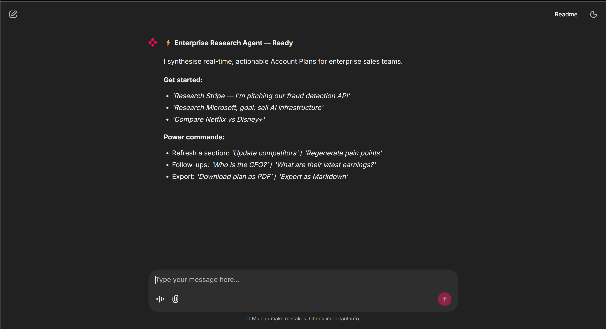
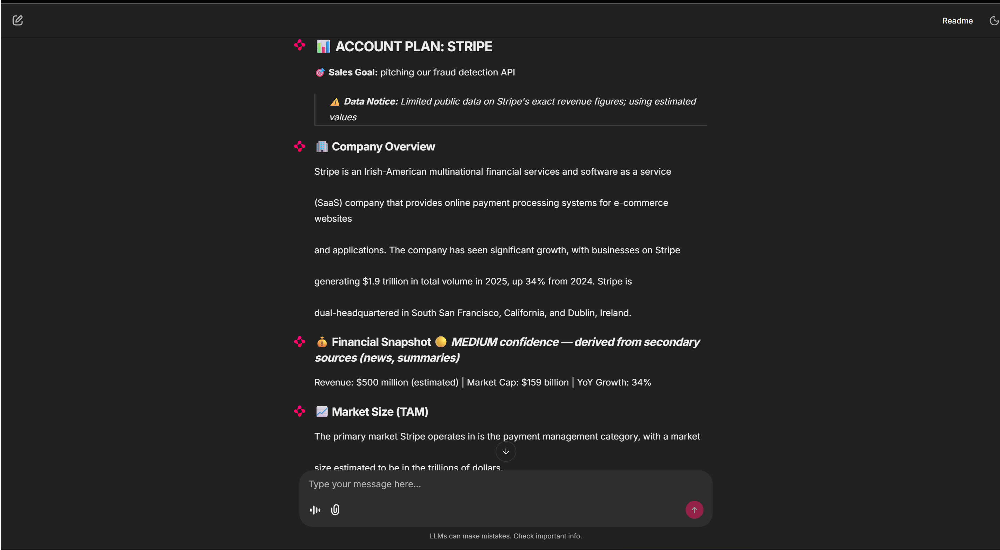

# 🧠 Enterprise Account Plan Research Agent
*Eightfold.ai AI Agent Assignment — Problem Statement 1: Company Research Assistant*

> Type a company name and a sales goal. Get a structured, confidence-scored Account Plan in seconds.

---

## 🚀 What It Does

A conversational AI agent that autonomously researches companies, synthesises findings from multiple web sources, and generates actionable 9-section Account Plans — with real-time progress updates, conflict resolution, and section-level refresh.

---

## 🌐 Live Demo

Try the deployed version: [Launch the Agent on Hugging Face](https://huggingface.co/spaces/codeAIDrafter/account-plan-agent)

> ⚠️ Note: Performance may vary due to API rate limits.

---

## ✨ Key Features

| Feature | Details |
|---|---|
| Multi-source research | SerpAPI (organic + news) → DuckDuckGo fallback, 5-min TTL cache |
| Full account plan | Overview, financials, TAM, competitors, executives, pain points, value prop, action plan |
| Section-level updates | Refresh any single section without regenerating the full plan |
| Adaptive retry | `default → fallback_reasoning → strict` strategy escalation on LLM failures |
| Output validation | `PlanOutputValidator` rejects vague/empty outputs before surfacing to the user |
| Confidence scoring | Per-section `🟢 HIGH / 🟡 MEDIUM / 🔴 LOW` with sourcing explanation |
| Conflict resolution | Flags data discrepancies >20%; queues user clarification |
| Streaming Q&A | Follow-up answers stream token-by-token |
| Company comparison | Parallel research on two companies as a side-by-side table |
| Export | Branded PDF (`fpdf2`) with Markdown fallback |
| Voice input | Whisper transcription (`whisper-large-v3`) |

---

## 🏗️ System Architecture

```
User Input (text / voice)
        │
        ▼
  Intent Classifier          ← LLM router, temp=0.0, deterministic
  (8 intent types)             extracts: intent, company, goal, sections
        │
        ▼
  ResearchAgent (Orchestrator)
  ├── NEW_COMPANY      → full 4-query concurrent research pipeline
  ├── SECTION_UPDATE   → targeted single-section refresh (5-level recovery)
  ├── CURRENT_COMPANY  → streaming direct answer
  ├── COMPARE          → parallel dual research
  └── GOAL_UPDATE      → derived section refresh
        │
   ┌────┴────────────────────┐
   ▼                         ▼
Search Layer            LLM Engine
SerpAPI / DDGS          Extraction + Synthesis
TTL Cache               Adaptive Retry Loop
                        PlanOutputValidator
                        Confidence Scoring
        │
        ▼
  AccountPlanState        ← per-session, hash-based change detection
        │
        ▼
   Chainlit UI             plan render · streaming · badges · PDF export
```

**Data flow in 6 steps:**
1. Message classified into one of 8 intents
2. Concurrent multi-query web search (up to 4 queries in parallel)
3. LLM synthesises structured JSON against a typed schema
4. Validator checks quality; triggers strict retry if output is vague/empty
5. Only changed fields written to state; plan hash prevents redundant re-renders
6. Chainlit renders plan with confidence badges; suggestions sent as a separate message

---

## ⚙️ Tech Stack

| | |
|---|---|
| Chat UI | Chainlit |
| LLM | Groq — `llama-3.3-70b-versatile` |
| Voice | Groq Whisper — `whisper-large-v3` |
| Search | SerpAPI (primary) · DuckDuckGo `ddgs` (fallback) |
| PDF | fpdf2 |
| Async | Python `asyncio` · `asyncio.to_thread` · `AsyncGroq` |
| Language | Python 3.10+ |

---

## 🧠 Design Decisions

**Async-first** — `asyncio.gather` runs 4 search queries concurrently, cutting research time ~3–4x vs sequential. All LLM calls use `AsyncGroq`; sync search libs are offloaded via `asyncio.to_thread`.

**Adaptive retry, not blind retry** — Each strategy escalates instruction pressure (`default → fallback_reasoning → strict`), mimicking how a human analyst rephrases when initial results are poor. Max: 2 strategy attempts + 1 strict per call.

**Validation layer** — Valid JSON ≠ useful output. `PlanOutputValidator` catches generic placeholders and empty lists before they reach the user, triggering one strict retry without NLP overhead.

**Section-level updates** — Refreshing one section shouldn't regenerate all nine. Targeted queries + smaller prompts = faster, cheaper, and more focused LLM output.

**Confidence scoring** — A sales rep acting on hallucinated revenue figures is a real risk. Per-section confidence badges let users know what to verify before sharing with a client.

**Trade-offs:**
- In-memory state only — keeps deployment stateless; production would add a session store
- Groq over GPT-4 — faster inference for streaming UX, slightly lower synthesis precision
- 20% conflict threshold — conservative to avoid false-positive clarification prompts

---

## 🧪 Persona Handling

| Persona | How the system handles it |
|---|---|
| 😕 Confused User | `CONFUSED_USER` intent → structured guidance with example commands; never a blank response |
| ⚡ Efficient User | Single message: *"Research Stripe — pitching fraud detection"* → full plan, zero back-and-forth |
| 💬 Chatty User | `GENERAL_QUESTION` intercepts off-topic messages; redirects without being dismissive |
| 🔥 Edge Cases | No company → prompt; implausible answers rejected + re-queued; unknown sections logged not silently written; all-strategies-exhausted → structured error, never a crash |

---

## ▶️ Setup & Run

```bash
# 1. Clone
git clone https://github.com/YOUR_USERNAME/enterprise-research-agent.git
cd enterprise-research-agent

# 2. Install
pip install -r requirements.txt

# 3. Configure
cp .env.example .env   # add your API keys

# 4. Run
chainlit run app.py -w
```

Open [http://localhost:8000](http://localhost:8000)

---

## 🔐 Environment Variables

```env
GROQ_API_KEY=        # Required — LLM calls, voice transcription
SERP_API_KEY=        # Optional — higher-quality search; falls back to DuckDuckGo
```

---

## 📸 Demo

## 📸 Demo

### 🎬 End-to-End Flow


### 📊 Sample Account Plan Output


**Typical session:**
1. *"Research Stripe — I'm pitching our fraud detection API"*
2. Progress steps stream: Searching → Scanning news → Synthesising → Building plan
3. Full plan renders with `🟢 / 🟡 / 🔴` confidence badges per section
4. *"Update pain points"* → only that section refreshes
5. *"Who is their CFO?"* → streams a direct answer
6. *"Download as PDF"* → branded PDF ready instantly

---

## ⚠️ Known Limitations

- No persistent storage — plans reset on page refresh
- Private/niche companies may return `LOW` confidence estimated data
- Groq rate limits may increase latency under high concurrency

---

## 🔮 Future Improvements

- Redis/SQLite session persistence
- Unit + integration test suite for pipelines and validator
- Clickable per-section source attribution
- TTS voice output for hands-free walkthroughs

---

## 🎯 Why This Stands Out

This isn't `response = llm.chat(user_input)`. It's a system with:

- **Explicit state machine** — the agent knows *what kind of task* it's doing before acting
- **Graceful degradation** — 3-strategy retry + 5-level section recovery means failure is handled, not hidden
- **Production hygiene** — per-session isolation, TTL caching, hash-based change detection, startup validation
- **UX-aware design** — confidence badges and section-level updates exist because bad data in a sales deck has real consequences
